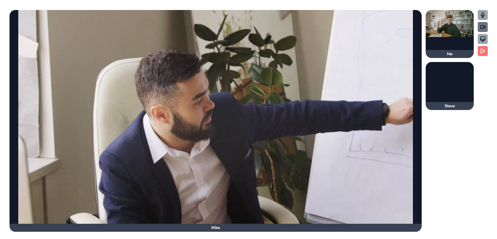

<p align="center"><a href="https://www.metered.ca/blog/building-a-group-video-chat-app-with-webrtc-and-php-laravel/" target="_blank"></a></p>


# Group Video Chat App with PHP Laravel and JavaScript

## Powered by [Metered Video SDK](https://www.metered.ca/)


## Overview

This application is a highly scalable group video calling application built using PHP Laravel and Metered Video SDK.

## Guide

To learn how this application is built you can read the blog post here: [Building a Group Video Chat App with WebRTC, PHP Laravel and Javascript](https://www.metered.ca/blog/building-a-group-video-chat-app-with-webrtc-and-php-laravel/)

## Setup Requirements

You need a Metered Domain and Secret Key to run this application, if you don't have one then you can follow the steps below to obtain it:

1. Signup for a free account at https://www.metered.ca
2. After Signup go to Dashboard -> Developers to find your Metered Domain and Secret Key.


You also need to have PHP Laravel and its dependencies installed, if you don't have them installed already then follow the guide here and install them first: https://laravel.com/docs/9.x#your-first-laravel-project

## Setting up the Project

1. Clone the project repo
```
git clone git@github.com:metered-ca/video-chat-app-php-laravel.git
```

2. cd into the project directory
```
cd video-chat-app-php-laravel
```

3. Install NPM packages
```
npm install
```

4. Create the .env file
```
cp .env.example .env
```
In the `.env` file replace the `<YOUR_METERED_DOMAIN>` with your Metered Domain and `<YOUR_METERED_SECRET_KEY>` with your Metered Secret Key.

5. Run the command below to start the application
```
php artisan serve
```

## Further Reading

- **[Metered Video SDK Documentation](https://www.metered.ca/docs/)**
- **[Metered Blog](https://www.metered.ca/blog/)**
- **[Embed Video Chat](https://www.metered.ca/docs/Metered-Embed/Basic-Embed-SDK-Guide/)**
